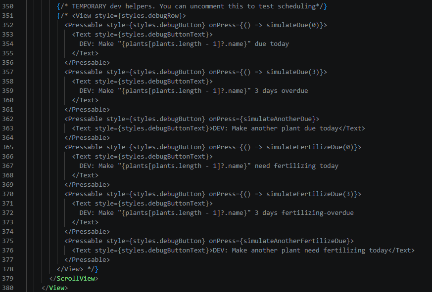
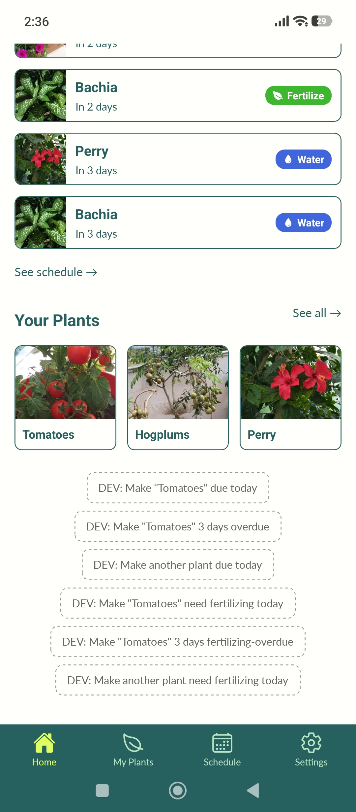
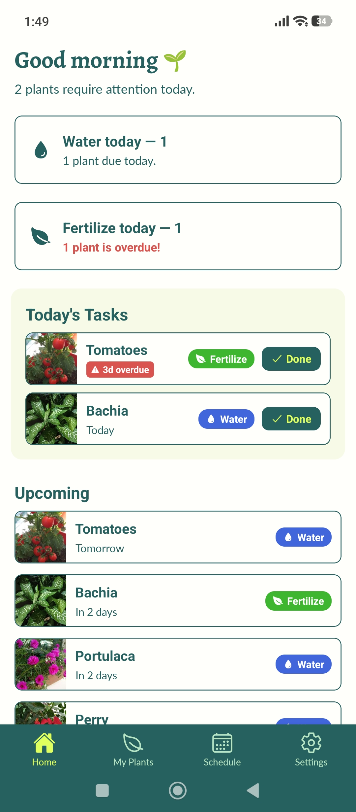
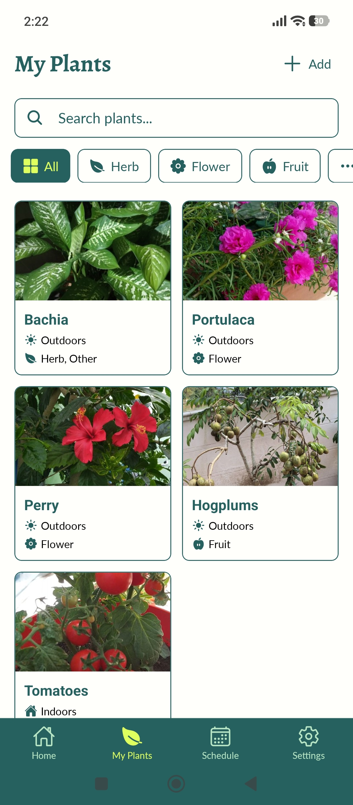
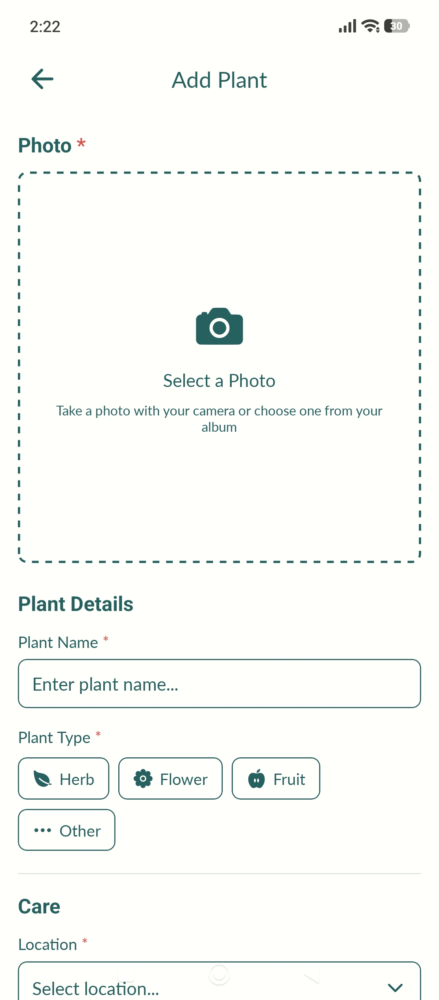
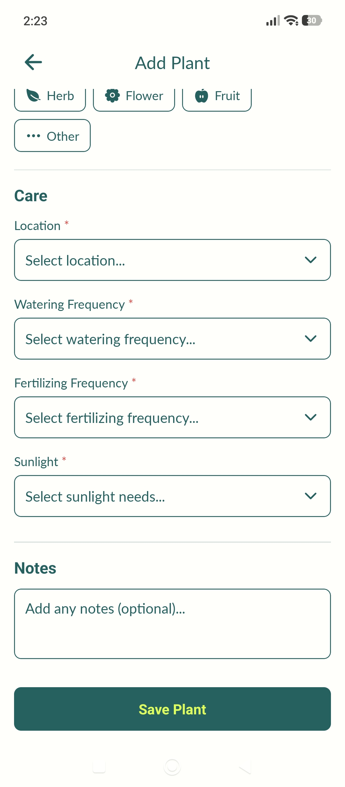
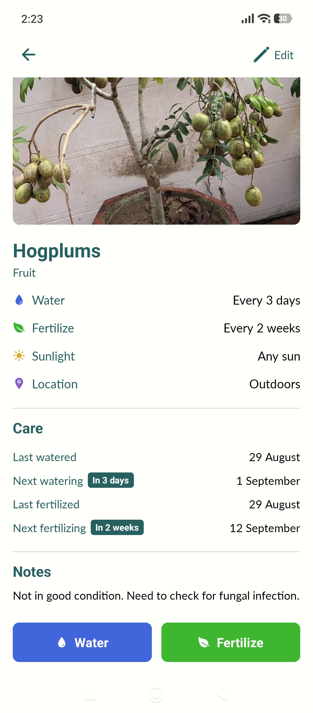
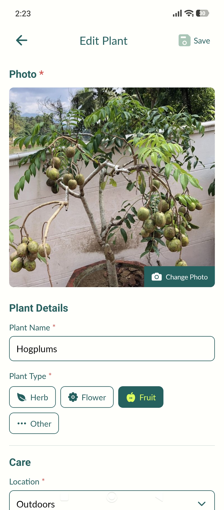
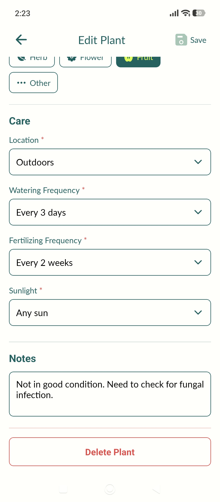
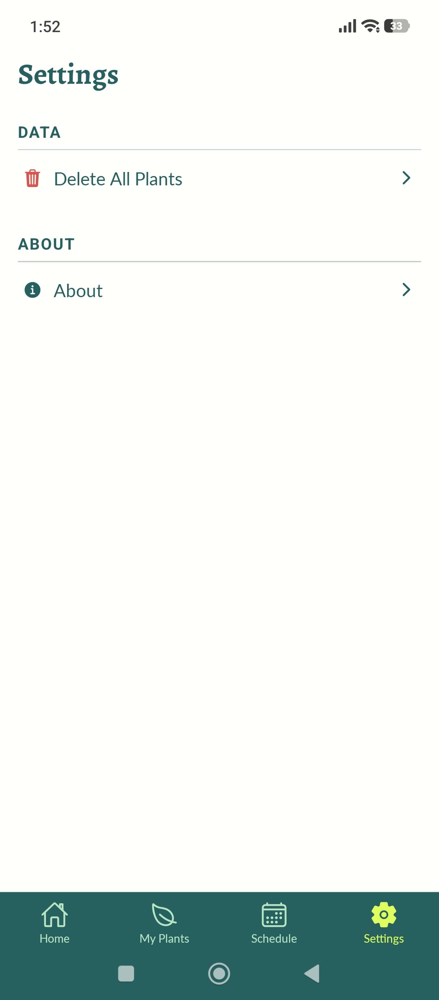

# Marigold - Plant Care App


Marigold is a Expo Go mobile application designed to help users
manage and care for their houseplants. Users can add plants, store information about them, track watering and
fertilizing, and view upcoming care tasks through a schedule.

---

## Installation & Run Instructions

### Prerequisites

Make sure the following are installed:

* [Node.js](https://nodejs.org/) (Install the LTS version)
* Expo Go on an Android or iOS device
* Git

You can check if Node.js and NPM is installed by running:

```bash
node -v
npm -v
```

### 1. Clone the repository

```bash
git clone https://github.com/Awfyboy/Marigold.git
cd marigold

# OR you can download the ZIP version (Click the 'Code' dropdown and 'Download ZIP')
```

### 2. Install dependencies

```bash
npm install
```

### 3. Start the Expo development server

```bash
npx expo start
```

### 4. Run the application

After the development server starts:

- **Android:** Open Expo Go and scan the QR code displayed in the terminal or browser.
- **iOS:** Open the Camera app and scan the QR code, then open the project in Expo Go.
- **Web:** Press `w` in the terminal or run:

```bash
npx expo start --web
```

### Notes

- This application was developed using **Expo SDK 54**, as that is the version supported by the official apps on Google Play Store and App Store. The project dependencies are defined in `package.json` and will be installed automatically when running `npm install`.

- You can test the application using DEV buttons. Go to 'index.tsx' and find Line 350. You will find commented DEV code. Once you uncomment it, saving the changes should show some DEV buttons below the Home screen. Use these to quickly test schedule changes of plants.



---

## Features

- **Home Dashboard** – Provides an overview of the user's plants and upcoming care activities, with a quick action to finish a task due today.


- **Plant Collection** – View all saved plants in one place, with search and filtering options.


- **Add Plants** – Add a new plant with details such as name, type, watering frequency, etc. Take an image using the camera or select a picture from the album.



- **Plant Details** – View detailed information about an individual plant, including its care requirements and watering information. Allow user to water or fertilize a plant earlier than their set date.


- **Edit Plants** – Update the details of an existing plant or delete them from your collection.



- **Settings** – Allow user to delete all data, or view the about section.


---

## Navigation

The application uses **Expo Router** for navigation. A stack-based
navigation structure is used to manage the different screens of the
application.

The main application screens are contained within a tab navigator:

- **Home** - Displays an overview of the user's plants and care information.
- **Plants** - Displays the user's saved plants.
- **Schedule** - Displays upcoming watering or fertilizing tasks.
- **Settings** - Provides simple data management and about section.

Additional screens are accessed through the stack navigation:

- **Add Plant** - Allows the user to add a new plant.
- **View Plant** - Displays detailed information about a selected plant.
- **Edit Plant** - Allows the user to modify an existing plant.

---

## Technologies Used

- **React Native 0.81.5** - Framework for building the mobile application.
- **Expo SDK 54** - Development platform used to build and run the application.
- **Expo Go** - Mobile app for testing and debugging the application 
- **TypeScript** - Provides static typing for the application.
- **Expo Router** - Handles screen-based navigation and routing.
- **AsyncStorage** - Provides local persistent storage for plant data.
- **Expo Image Picker** - Allows users to select images from their device.
- **Expo Font** - Handles custom fonts used by the application.
- **Expo Vector Icons** - Provides icons used throughout the interface.

---

## Known Issues & Future Improvements

- Allow a custom time to be set for watering and fertilizing
- Cropping feature limited, can be obfuscated due to Android UI
- Allow multiple filters to be selected in Search
- Add more plant types
- Add local notifications
- Add dark mode
- Add more actions other than watering and fertilizing

---

## Student Info
- Awf Ibrahim Mohamed (SID: 24047957)
- Bachelors (Hons) Computer Science
- Module Name: Mobile Applications